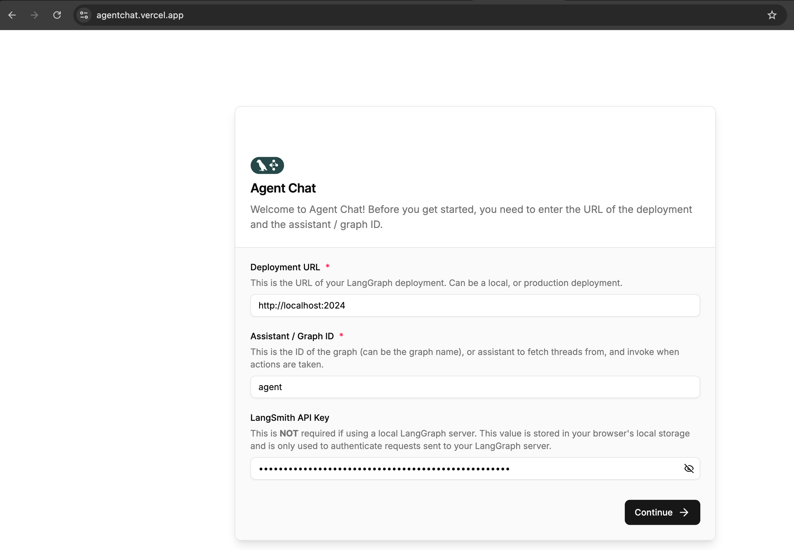

# Building an Intelligent Customer Support Agent: A Journey Through the LangChain Ecosystem

## Introduction

Imagine a customer service agent that never sleeps, responds instantly to inquiries about orders and refunds, knows when to escalate complex issues to humans, and continuously improves through rigorous evaluation. This project brings that vision to life as a demonstration of the LangChain ecosystem's capabilities for building production-ready AI agents.

At its heart, this is a story about learning by doing—exploring the vast landscape of agent architectures, tooling, and evaluation frameworks while keeping one principle paramount: **simplicity first**.

## Design Philosophy: Keep It Simple

Rather than building a sprawling multi-agent system from the outset, this project embraces an intentionally straightforward architecture. The customer support agent serves as a focused exploration of core concepts: tool usage, knowledge retrieval, human-in-the-loop patterns, and comprehensive testing. By mastering these fundamentals, we create a solid foundation for future complexity.

### The Agent's Journey

When a customer reaches out with a question, the agent springs into action. It searches through a vector database containing company policies and retrieves relevant customer data from mock databases. Armed with this context, it responds to inquiries about orders, refunds, and account issues. But here's the crucial part: the agent knows its limits. When an issue requires human judgment or escalation, it gracefully interrupts the workflow to create a support ticket, ensuring customers get the care they need.

*The agent's workflow: a clean cycle between reasoning, tool usage, and knowing when to stop or escalate.*

### Architecture in Action

The system architecture reflects real-world production considerations:

- **Knowledge Layer**: Vector database for policy documents and mock customer data stores
- **Intelligence Layer**: Powered by Ollama's `llama3.2:1b` model for local, cost-effective inference
- **Interface Layer**: LangChain Studio and Agent UI provide a streaming chat experience
- **Quality Assurance**: Comprehensive TDD tests ensure reliability
- **Deployment**: Docker configuration for consistent environments across development and production

*The Agent Chat UI: a simple, clean interface for interacting with the customer support agent via localhost deployment.*

### Rigorous Evaluation Framework

Quality isn't accidental—it's measured. The evaluation system puts the agent through its paces with 10 diverse customer scenarios, scoring responses across five dimensions:

1. **Tool Usage**: Does the agent call the right functions?
2. **Keyword Presence**: Are critical terms and information included?
3. **Response Quality**: Is the answer accurate and complete?
4. **Empathy**: Does the agent acknowledge customer concerns?
5. **Actionability**: Can the customer act on the guidance provided?

Every evaluation run uploads detailed results to the [LangSmith dashboard](https://smith.langchain.com), complete with conversation traces, per-test feedback explaining pass/fail decisions, and aggregate scores. This creates a feedback loop for continuous improvement and regression detection.

*The evaluation dataset: 10 diverse customer scenarios testing everything from frustrated complaints to simple inventory questions.*

*Performance metrics across all evaluation dimensions, with aggregate scores showing how the agent performs on tool usage, response quality, empathy, and more.*

**Running Evaluations**: Execute `python -m src.support_agent.tests.eval_langsmith` and view comprehensive metrics in LangSmith's web interface to track performance trends over time.

## The Road Ahead

This foundation opens doors to exciting possibilities:

**Multi-Agent Workflows**: Evolve from a single agent to a supervised ensemble where specialized agents handle distinct business processes—one for refunds, another for order modifications, each an expert in its domain. A primary assistant would orchestrate these specialists, routing requests to the right team member.

**Enhanced Human Collaboration**: Implement more sophisticated interrupt patterns for confirmations and executions, creating seamless handoffs between AI and human agents.

**Enterprise Data Integration**: Replace mock data with SQL-based customer databases, connecting the agent to real business systems and workflows.

The journey from simple to sophisticated is just beginning—but the foundation is rock solid.